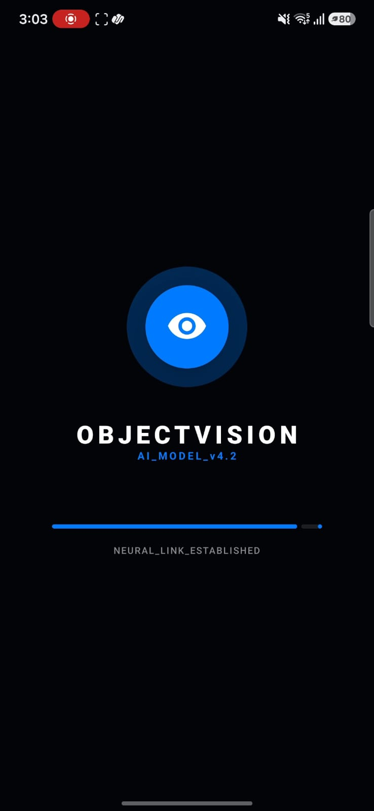
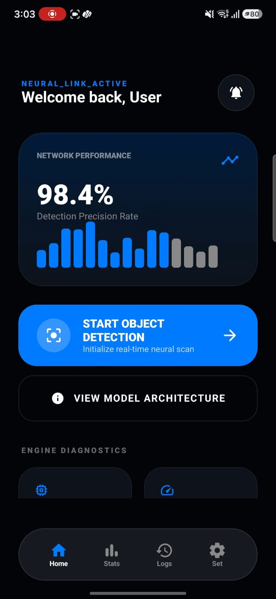
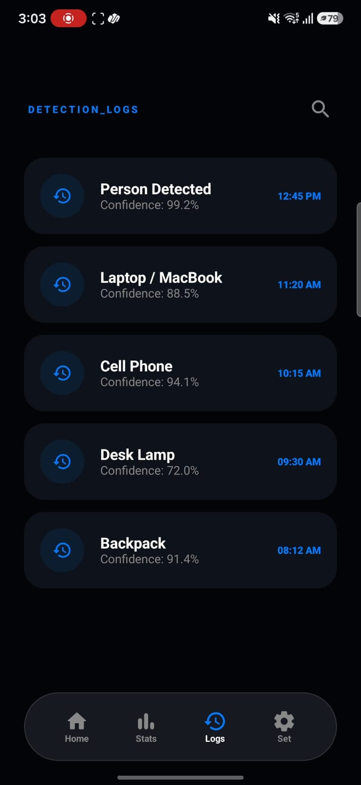
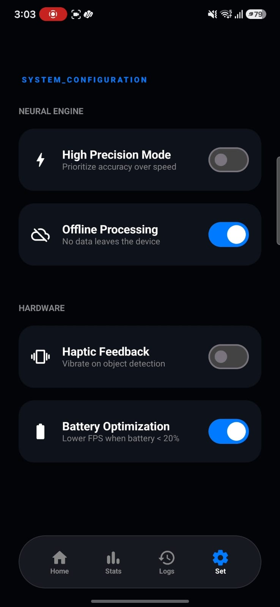
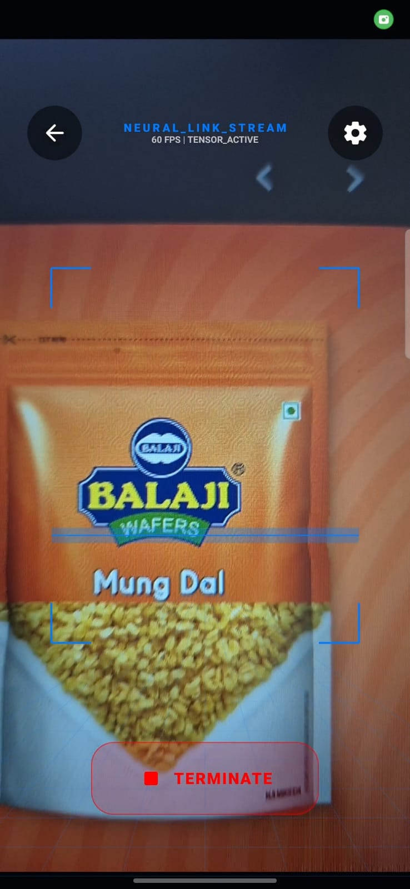
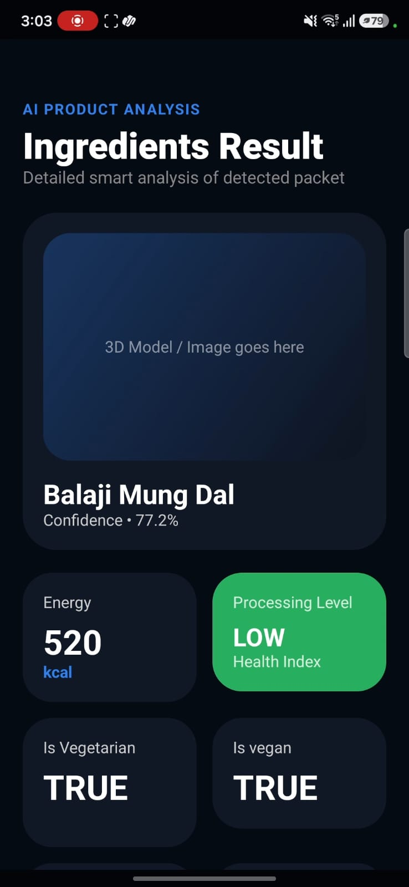
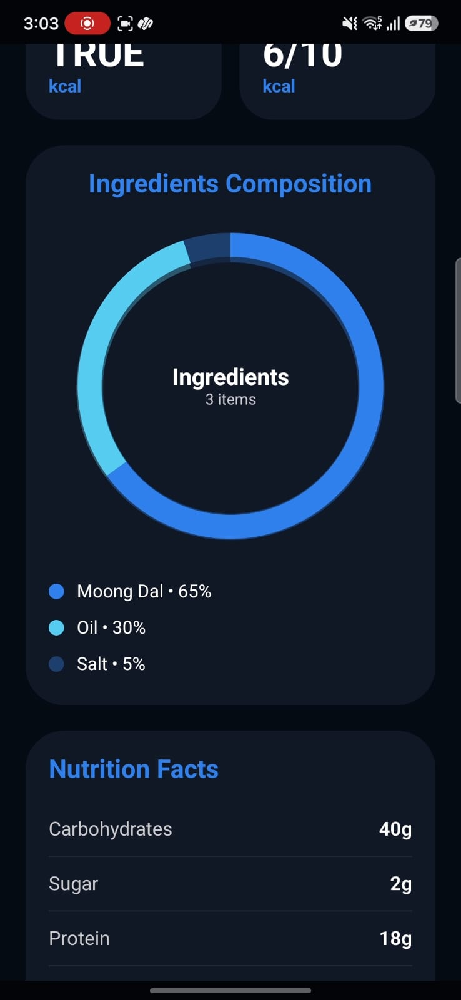
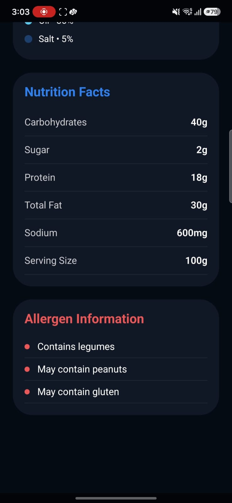

<div align="center">


<br/><br/>

# 🎯 ObjectVision

### *A real-time, on-device object & product scanner with a sci-fi neural-scan interface.*

A native Android app built in Kotlin + Jetpack Compose. It combines a live-camera **object detection HUD** (scanning brackets, perspective grid, laser scan line, live bounding boxes) with an **AI product scanner** — point the camera at a packaged food item and get back its ingredients, nutrition facts, allergen warnings, and a health score.

<br/>

[✨ Features](#-features) • [📸 Screens](#-screens) • [🛠️ Tech Stack](#%EF%B8%8F-tech-stack) • [🏗️ Architecture](#%EF%B8%8F-architecture) • [🚀 Getting Started](#-getting-started) • [🔮 Roadmap](#-roadmap)

</div>

---

## ✨ Features

| Feature | Description |
|---|---|
| 📷 **Live Camera Feed** | Full-screen CameraX preview with an animated sci-fi HUD (perspective grid, corner scan brackets, sweeping laser line) |
| 🟩 **General Object Detection** | Detects everyday objects (person, laptop, phone, backpack, etc.) with live bounding boxes and confidence scores |
| 🥫 **AI Product & Ingredient Analysis** | Point the camera at a packaged food product to identify it and pull up a full nutrition breakdown |
| 🍬 **Ingredients Composition** | Visual donut chart breaking down the product's ingredients by percentage |
| ⚠️ **Allergen Information** | Flags allergens like legumes, peanuts, and gluten |
| 🥗 **Health Score & Diet Flags** | Health index (e.g. "LOW" processing level), a 0–10 health score, and Vegetarian/Vegan indicators |
| 📊 **Stats Dashboard** | Detection precision rate, inference speed, and session counters |
| 🕓 **Detection Logs** | Searchable history of past detections with timestamps and confidence scores |
| ⚙️ **Configurable Engine** | Toggle high-precision mode, offline-only processing, haptic feedback, and battery optimization |
| 🌑 **Dark, HUD-Style UI** | Consistent deep-space theme (`#020408` background, `#007BFF` neon-blue accent) across every screen |

---

## 📸 Screens

<div align="center">
<table>
  <tr>
    <td align="center"><b>Splash</b></td>
    <td align="center"><b>Home</b></td>
    <td align="center"><b>Detection Logs</b></td>
    <td align="center"><b>Settings</b></td>
  </tr>
  <tr>
    <td></td>
    <td></td>
    <td></td>
    <td></td>
  </tr>
  <tr>
    <td align="center"><b>Live Scan</b></td>
    <td align="center"><b>Product Analysis</b></td>
    <td align="center"><b>Ingredients Breakdown</b></td>
    <td align="center"><b>Nutrition & Allergens</b></td>
  </tr>
  <tr>
    <td></td>
    <td></td>
    <td></td>
    <td></td>
  </tr>
</table>

<sub>Real captures from the app demo — scanning a Balaji Wafers Mung Dal packet end-to-end.</sub>
</div>

---

## 🛠️ Tech Stack

```
├── Language        →  Kotlin (100%)
├── UI Framework    →  Jetpack Compose (Material 3)
├── Navigation      →  Compose Navigation (NavGraph, single-activity)
├── Camera          →  CameraX (core, camera2, lifecycle, view)
├── ML Pipeline     →  TensorFlow Lite + YOLOv8 (on-device, planned/in-progress)
└── Build System    →  Gradle (Kotlin DSL)
```

### Project Structure

```
app/src/main/java/com/example/objectdetection_system/
├── MainActivity.kt              # Single-activity entry point, hosts the NavGraph
├── NavGraph.kt                  # Navigation graph wiring all screens together
├── ui/theme/                    # Color.kt, Type.kt, Theme.kt — app-wide Material theme
└── ui/screens/
    ├── SplashScreen.kt          # Animated "ObjectVision" boot/loading sequence
    ├── HomeScreen.kt            # Dashboard, detection precision rate, start button
    ├── DetectionScreen.kt       # Live camera feed + HUD overlay + bounding boxes
    ├── ProductAnalysisScreen.kt # Ingredients, nutrition facts, allergens, health score
    ├── StatsScreen.kt           # Inference speed, confidence, model size, session count
    ├── LogsScreen.kt            # Searchable detection history
    ├── SettingsScreen.kt        # Precision mode, offline processing, haptics, battery
    └── AboutModelScreen.kt      # Explains the underlying detection model
```

---

## 🏗️ Architecture

```
CameraX PreviewView (live feed)
        ↓
ImageAnalysis.Analyzer (ObjectDetectorAnalyzer)
        ↓
TensorFlow Lite Interpreter  →  YOLOv8 model (.tflite)
        ↓
  ┌─────────────────────┴─────────────────────┐
  ↓                                           ↓
Bounding Box list (List<Rect>)      Packaged-product match
  ↓                                           ↓
Compose State (mutableStateOf)      Nutrition/ingredients lookup
  ↓                                           ↓
Canvas overlay (HUD, boxes)         Product Analysis screen
```

The `DetectionScreen` wires up the **CameraX → Analyzer → Compose Canvas** pipeline end-to-end for general object detection. For packaged products, a detected item is matched against a product database to surface ingredients, nutrition facts, allergens, and a health score on the **Product Analysis** screen. The `ObjectDetectorAnalyzer` class is scaffolded with the exact steps needed to plug in a `.tflite` model — converting each camera frame, running inference, parsing YOLOv8 output into bounding boxes, and filtering by confidence.

---

## 🚀 Getting Started

### Prerequisites

- Android Studio (Hedgehog or later)
- JDK 11+
- An Android device or emulator with camera support

### Installation

```bash
git clone https://github.com/samihavahora05/ObjectDetection.git
cd ObjectDetection
```

Open in Android Studio → Sync Gradle → Run on a device/emulator with camera access.

### Adding the detection model

To enable live inference:

1. Drop a YOLOv8 `.tflite` model file into `app/src/main/assets/`
2. Add the TensorFlow Lite dependencies to `app/build.gradle.kts`:
   ```kotlin
   implementation("org.tensorflow:tensorflow-lite:2.14.0")
   implementation("org.tensorflow:tensorflow-lite-support:0.4.4")
   ```
3. Complete the `ObjectDetectorAnalyzer.analyze()` function in `DetectionScreen.kt` — it's scaffolded with numbered steps for loading the interpreter, running inference, and parsing bounding boxes.

---

## 🔮 Roadmap

- 🧠 Wire up the TensorFlow Lite interpreter and a trained YOLOv8 `.tflite` model
- 🎚️ Live confidence-threshold slider in Settings
- 🏷️ Class labels rendered alongside each bounding box
- 🥫 Expand the packaged-product database beyond the current demo item
- 💾 Persist detection logs locally (Room database)
- 📤 Export detection history as CSV/JSON

<div align="center">

⭐ If you found this project interesting, give it a star!

Built with Kotlin, Jetpack Compose, and CameraX.

</div>
